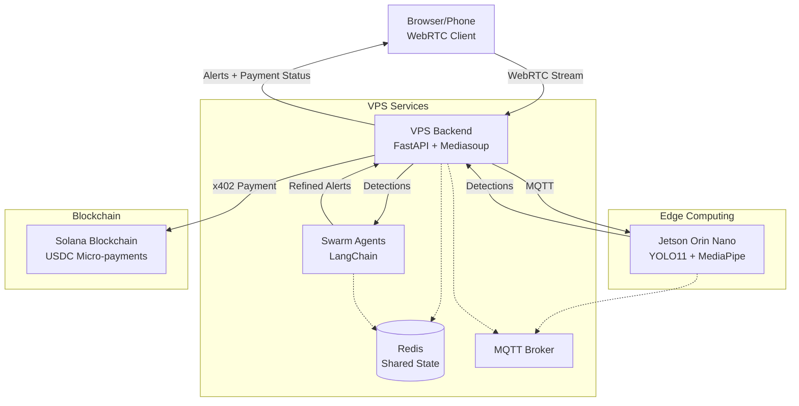

# DETECH - Decentralized AI Vigilance Swarm

## Overview

DETECH is a decentralized AI Vigilance Swarm for real-time environmental awareness. The system combines edge computing (Jetson Orin Nano) with agentic swarm intelligence for collaborative analysis, enabling gesture-to-command interpretation with a micro-payment economy on Solana.

## Architecture



## Key Components

### 1. Frontend (Next.js 14)
- **Location**: `frontend/`
- **Technologies**: Next.js 14, TypeScript, React Webcam, WebRTC, WalletConnect
- **Features**:
  - Browser-based WebRTC stream capture
  - WalletConnect integration for Solana wallet
  - Real-time alert display
  - Payment status tracking

### 2. Backend (FastAPI)
- **Location**: `backend/`
- **Technologies**: FastAPI, Mediasoup, Socket.IO, Solana web3.py
- **Features**:
  - WebRTC stream relay via Mediasoup
  - MQTT communication with Jetson
  - Swarm coordination
  - x402 payment processing
  - Real-time alert broadcasting

### 3. Jetson Edge (Python)
- **Location**: `jetson-edge/`
- **Technologies**: YOLO11, MediaPipe, OpenCV, MQTT
- **Features**:
  - Real-time object detection (YOLO11)
  - Gesture recognition (MediaPipe)
  - MQTT-based detection publishing
  - Edge-optimized processing

### 4. Swarm Agents (LangChain)
- **Location**: `swarm-agents/`
- **Technologies**: LangChain, OpenAI, Redis
- **Features**:
  - Alert refinement agent
  - Context analysis agent
  - Collaborative decision-making
  - Historical pattern analysis

### 5. Shared Utilities
- **Location**: `shared/`
- **Contents**:
  - Pydantic schemas for detections/alerts
  - Solana x402 helpers
  - Common utilities

## Setup Instructions

### Prerequisites

- Node.js 18+ and npm
- Python 3.10+
- Docker and Docker Compose
- Solana wallet (for payments)
- OpenAI API key (for swarm agents)

### 1. Frontend Setup

```bash
cd frontend
npm install
npm run dev
```

The frontend will be available at `http://localhost:3000`

### 2. Backend Setup

```bash
cd backend
pip install -r requirements.txt
# Create .env file with configuration:
# SOLANA_RPC_URL=https://rpc.helius.xyz
# SOLANA_WALLET_PRIVATE_KEY=your_key_here
# X402_AGENT_PRIVATE_KEY=base58_test_keypair
# X402_USDC_MINT=EPjFWdd5AufqSSqeM2qoi9GAJh9zn7wo7GSaJ6y4wDR
# REDIS_HOST=localhost
# MQTT_BROKER_HOST=localhost

python -m app.main
```

The backend API will be available at `http://localhost:8000`

### 3. Jetson Edge Setup

```bash
cd jetson-edge
pip install -r requirements.txt
# For Jetson Orin Nano, use JetPack SDK
# For simulation, use docker-compose

python -m src.main
```

### 4. Swarm Agents Setup

```bash
cd swarm-agents
pip install -r requirements.txt
# Set OPENAI_API_KEY environment variable

python -m src.main
```

### 5. Docker Compose (All Services)

```bash
cd docker
docker-compose up -d
```

This will start:
- Redis (port 6379)
- MQTT Broker (port 1883)
- Backend API (port 8000)
- Swarm Agents (port 8001)
- Jetson Simulator

## Environment Variables

### Backend (.env)
```
HOST=0.0.0.0
PORT=8000
DEBUG=false
REDIS_HOST=localhost
REDIS_PORT=6379
MQTT_BROKER_HOST=localhost
MQTT_BROKER_PORT=1883
SOLANA_RPC_URL=https://rpc.helius.xyz
SOLANA_NETWORK=mainnet-beta
SOLANA_WALLET_PRIVATE_KEY=your_key_here
X402_AGENT_PRIVATE_KEY=base58_test_keypair
X402_USDC_MINT=EPjFWdd5AufqSSqeM2qoi9GAJh9zn7wo7GSaJ6y4wDR
X402_MAX_RETRIES=3
X402_RETRY_BACKOFF_SECONDS=0.5
X402_PROGRAM_ID=program_id_here
SWARM_API_URL=http://localhost:8001
```

### Frontend (.env.local)
```
NEXT_PUBLIC_BACKEND_URL=http://localhost:8000
NEXT_PUBLIC_SOLANA_RPC_URL=https://rpc.helius.xyz
NEXT_PUBLIC_SOLANA_NETWORK=mainnet-beta
```

### Swarm Agents (.env)
```
OPENAI_API_KEY=your_openai_key_here
REDIS_HOST=localhost
REDIS_PORT=6379
```

## Data Flow

1. **Stream Capture**: Browser captures video via WebRTC
2. **Stream Relay**: Backend relays stream to Jetson via MQTT
3. **Edge Detection**: Jetson runs YOLO11 + MediaPipe on frames
4. **Detection Publishing**: Jetson publishes detections via MQTT
5. **Swarm Refinement**: Backend forwards detections to Swarm
6. **Alert Generation**: Swarm agents refine detections into alerts
7. **Payment Processing**: Backend triggers x402 payment on Solana
8. **Alert Delivery**: Backend sends alerts + payment status to frontend

## API Documentation

### Endpoints

#### `GET /health`
Health check endpoint.

**Response**:
```json
{
  "status": "healthy",
  "streaming_service": true,
  "solana_service": true
}
```

#### `POST /api/v1/payment`
Create x402 payment for alert.

**Request**:
```json
{
  "recipient": "Solana_address",
  "amount_usdc": 0.01,
  "alert_id": "alert-123"
}
```

**Response**:
```json
{
  "tx_signature": "transaction_signature",
  "status": "pending"
}
```

#### `GET /api/v1/payment/{tx_signature}`
Verify payment transaction.

**Response**:
```json
{
  "tx_signature": "transaction_signature",
  "verified": true
}
```

## Testing

### Backend Tests
```bash
cd backend
pytest tests/backend/
```

### Frontend Tests
```bash
cd frontend
npx playwright test
```

### Integration Tests
```bash
pytest tests/integration/
```

## Development Workflow

1. Start infrastructure: `docker-compose up -d` (redis, mqtt)
2. Start backend: `cd backend && python -m app.main`
3. Start swarm: `cd swarm-agents && python -m src.main`
4. Start frontend: `cd frontend && npm run dev`
5. Start Jetson simulator: `cd jetson-edge && python -m src.main`

## Production Deployment

1. Configure environment variables for each service
2. Set up proper Solana wallet with funding
3. Configure Mediasoup for production WebRTC
4. Set up proper SSL/TLS certificates
5. Configure monitoring and logging
6. Deploy to VPS with Docker Compose

## Troubleshooting

### WebRTC Connection Issues
- Check Mediasoup configuration
- Verify firewall/port settings
- Check browser permissions

### MQTT Connection Issues
- Verify MQTT broker is running
- Check network connectivity
- Review MQTT topic subscriptions

### Solana Payment Issues
- Verify wallet has sufficient USDC
- Check Solana RPC endpoint
- Review x402 program ID

## License

[Your License Here]

## Contributing

[Contributing Guidelines Here]
